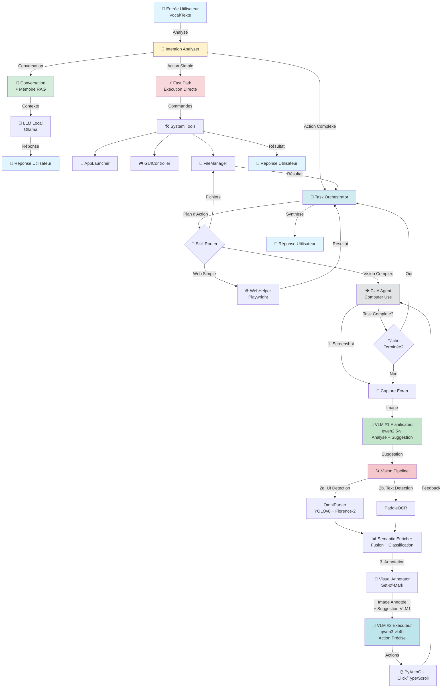

#  MUAG - Multi-modal Autonomous Agent (Local)

**MUAG** est un agent autonome multimodal entièrement **local**, capable d'interagir vocalement, de réfléchir et d'exécuter des actions complexes sur votre ordinateur en "voyant" l'écran comme un humain.


---

##  Démonstrations Vidéo

### 1.  Mémoire & Conversation Contextuelle
*Démonstration de la persistance de la mémoire entre les sessions et du rappel des interactions passées.*

> **Exemple :** "Quelle est notre dernière interaction ?"
> 
https://github.com/user-attachments/assets/3cbb0a25-2d0e-4800-bcd8-b2f0d3ce6b40

---

### 2.  Actions Rapides (Fast Path)
*Exécution instantanée sans planification pour les tâches simples - ouverture d'applications, fichiers, contrôle système.*

> **Exemple :** Ouvrir un fichier texte sur le bureau
>
https://github.com/user-attachments/assets/3015e56e-e181-4c65-86ff-fc4ccf8ed7ae

---

### 3.  Navigation Web & Extraction de Données
*Pipeline complète : recherche web → extraction d'informations → création de fichier automatique.*

> **Exemple :** Chercher la météo et créer un fichier texte avec les résultats sur le bureau
> 
https://github.com/user-attachments/assets/cf3debde-b943-4f05-ad5d-61e2fd17e1a6

---

### 4.  Navigation Visuelle dans Applications Desktop (CUA)
*Contrôle autonome d'applications tierces par vision pure - aucune API, juste comme un humain.*

> **Exemple :** Ouvrir Spotify et naviguer dans les titres likés
> 
https://github.com/user-attachments/assets/379c81b7-7fae-44c0-9359-e9f149e7d24e

---

##  Architecture Globale

MUAG repose sur une architecture de décision hybride qui optimise la latence, la fiabilité et les capacités autonomes.



---

##  Pipeline Détaillée

### 1️ Analyse d'Intention

Chaque requête utilisateur passe par un **Intention Analyzer** (LLM) qui classifie la demande :

| Type | Description | Route |
|------|-------------|-------|
| **CONVERSATION** | Discussion naturelle, questions générales | → Memory Manager + LLM |
| **ACTION_SIMPLE** | Commande directe (1 action) : lancer app, volume, ouvrir fichier | → Fast Path (exécution immédiate) |
| **ACTION_COMPLEXE** | Tâche multi-étapes : navigation web, interaction app, création fichiers | → Task Orchestrator |

**Exemples de classification :**
-  "Comment vas-tu ?" → CONVERSATION
-  "Lance Spotify" → ACTION_SIMPLE
-  "Cherche la météo et crée un fichier" → ACTION_COMPLEXE

---

### 2 Fast Path (Actions Simples)

Exécution **immédiate** sans planification pour minimiser la latence.

**Capacités :**
-  **Lancement d'applications** : détection intelligente par nom (AppLauncher)
-  **Contrôle système** : volume, lecture média (play/pause/next), captures d'écran
-  **Gestion fichiers** : ouverture de fichiers/dossiers/URLs
-  **Raccourcis clavier** : copier/coller, sauvegarder, annuler, etc.

**Mapping intelligent :**
```python
"Monte le volume" → volume_up
"Musique suivante" → next_track
"Ouvre Chrome" → launch_app("chrome")
"Ouvre notes.txt" → open_file("Desktop/notes.txt")
```

---

### 3 Task Orchestrator (Actions Complexes)

Le cerveau tactique pour les **tâches multi-étapes**.

**Fonctionnement :**

1. **Analyse de la tâche** : Le LLM crée un plan initial avec les étapes nécessaires
2. **Boucle de décision** : À chaque étape, décision intelligente du prochain skill à utiliser
3. **Exécution distribuée** : Délégation aux skills spécialisés
4. **Feedback loop** : Mise à jour du contexte et vérification de progression

**Skills disponibles :**

| Skill | Usage | Exemples |
|-------|-------|----------|
| `open_url` | Ouvrir URL initiale | "Va sur YouTube" |
| `web_helper` | Actions web simples (Playwright) | "Clique sur Login", "Cherche météo" |
| `cua_vision` | Actions web/desktop complexes (vision) | "Clique sur la 3ème vidéo", "Navigue dans Spotify" |
| `file_manager` | Gestion fichiers | "Crée fichier.txt", "Lis document.pdf" |
| `app_launcher` | Lancer applications | "Ouvre Discord" |

**Exemple de plan généré :**
```
Tâche : "Va sur YouTube cherche Messi"
├─ Step 1: open_url → https://youtube.com/results?search_query=messi
└─ Step 2: cua_vision → Cliquer première vidéo
```

**Protection anti-boucle :** Détection automatique de patterns répétitifs (ABABAB) pour éviter les blocages infinis.

---

### 4 CUA Agent (Computer Use Agent)

Le cœur de l'innovation : un agent qui **voit** et **agit** comme un humain, sans API.

####  Pipeline Vision Avancée

**Architecture Dual-VLM + OmniParser :**

```
Screenshot → Preprocessing → Vision Detection → Annotation → VLM Decision → Execution
```

##### **Étape 1 : Capture & Preprocessing**
- Screenshot de l'écran complet
- Preprocessing OpenCV (netteté, contraste, débruitage)
- Redimensionnement intelligent (crop 70% droite pour focus zone utile)

##### **Étape 2 : Vision Detection (Triple Pipeline)**

**2a. OmniParser - UI Element Detection**
- **YOLOv8** : Détection rapide des éléments interactifs (boutons, champs, icônes)
- **Florence-2** : Compréhension sémantique fine des widgets et leur fonction

**2b. PaddleOCR - Text Extraction**
- Extraction ultra-précise de **tout** le texte visible à l'écran
- Support multi-langue, rotation automatique

**2c. Semantic Enricher - Fusion Intelligente**
- Fusionne les résultats OmniParser + OCR
- Classification fonctionnelle (bouton, lien, input, text, etc.)
- Contextualisation spatiale (toolbar, content, footer)
- Description enrichie pour chaque élément

**Format de sortie enrichi :**
```json
{
  "id": 42,
  "label": "Connexion",
  "type": "button",
  "functional_type": "primary_action",
  "bbox": [450, 320, 550, 360],
  "center": [500, 340],
  "enriched_description": "Bouton principal 'Connexion' - Action de login",
  "visual_description": "Blue rounded button with white text",
  "ocr_nearby": "Connexion",
  "spatial_context": "content - center-right",
  "confidence": 0.95
}
```

##### **Étape 3 : Visual Annotation (Set-of-Mark)**
- Reconstruction de l'image avec **boîtes englobantes**
- **ID numériques uniques** superposés en vert sur chaque élément
- Distinction visuelle par type (boutons en bleu, inputs en rouge, textes OCR en cyan)

##### **Étape 4 : Dual-VLM Decision**

**VLM #1 - Planificateur (qwen2.5-vl) :**
- Analyse la capture d'écran brute
- Évalue la progression de la tâche
- Décide si la tâche est terminée
- Fournit une **suggestion haut niveau** en langage naturel

Exemple :
```json
{
  "description": "Page de résultats YouTube visible",
  "suggestion": "Cliquer sur la première vidéo des résultats",
  "task_complete": false
}
```

**VLM #2 - Exécuteur (qwen3-vl:4b) :**
- Reçoit l'image **annotée** avec IDs visibles
- Reçoit la liste détaillée des éléments cliquables
- Traduit la suggestion en **action précise** avec ID d'élément

**Optimisation : Cropping Intelligent**
- Le LLM détermine la zone pertinente (toolbar/content/footer)
- L'image annotée est croppée pour focus maximal
- Réduction du bruit visuel pour le VLM

Exemple de décision VLM #2 :
```json
{
  "action": "click_on_element",
  "params": {
    "id": 17
  },
  "reasoning": "Cliquer sur l'élément 17 (première vidéo)"
}
```

**Support des Séquences :**
```json
{
  "action": "sequence",
  "params": {
    "steps": [
      {"action": "click_on_element", "params": {"id": 8}},
      {"action": "type_text", "params": {"text": "Messi"}},
      {"action": "press_key", "params": {"key": "enter"}}
    ]
  }
}
```

##### **Étape 5 : Execution (PyAutoGUI)**
- **Correction de scale** : coordonnées préprocessées → coordonnées réelles
- Actions précises : click, type, scroll, hotkeys
- Délais adaptatifs pour stabilité
- Feedback visuel temps réel

**Actions supportées :**
- `click_on_element` : Clic sur élément par ID
- `type_text` : Saisie de texte
- `press_key` : Touche unique (Enter, Tab, Escape)
- `hotkey` : Raccourcis (Ctrl+C, Alt+F4)
- `scroll` : Défilement
- `wait` : Attente
- `sequence` : Chaîne d'actions

##### **Étape 6 : Feedback Loop**
- Capture du nouvel état après action
- Détection de changements visuels (Screen Monitor)
- Retour à VLM #1 pour réévaluation
- Décision : continuer / changer de stratégie / terminer

---

### 5 Playwright Router (Fast-Path Web)

**Optimisation hybride Vision + DOM :**

Avant le pipeline vision lourd, tentative d'exécution **directe via Playwright** :
- Connexion au Chrome en debug mode (CDP)
- Parsing DOM pour matching intelligent
- Scoring multi-stratégies (exact, substring, mots-clés)
- Gestion robuste : Shadow DOM, iframes, popups

**Fallback automatique :** Si Playwright échoue → Vision pipeline

**Gain :** Latence divisée par 5 sur actions web simples.

---

### 6 WebHelper (Support Playwright Avancé)

**Capacités :**
- Connexion CDP avec retry logic
- Scan page avancé (clickables + inputs dans Shadow DOM / iframes)
- Matching intelligent avec scoring (exact, substring, fuzzy)
- Actions robustes : click, type, navigate, read
- Gestion automatique des popups/cookies
- Extraction de contenu pour analyse LLM

**Détection étendue :**
```javascript
// Détecte même les inputs cachés/iframes
input, textarea, [contenteditable='true'], [role='textbox']
+ iframes + Shadow DOM + data-testid patterns
```

---

##  Fonctionnalités Complètes

###  Interaction Multimodale
- **Full Duplex** : Entrée vocale (Whisper) + Sortie vocale (TTS)
- **Mode texte** : Fallback pour debug ou utilisation silencieuse
- **Mémoire persistante** : RAG avec consolidation de session
- **Profil utilisateur** : Apprentissage automatique des préférences (ton, contexte)

###  Contrôle Système (Direct)
- Lancement d'applications intelligent (recherche fuzzy par nom)
- Contrôle média complet (volume, lecture, pause, next/previous)
- Gestion fichiers/dossiers (ouvrir, lire, créer, lister)
- Raccourcis clavier système
- Captures d'écran

###  Navigation Web Autonome
- Recherche Google/YouTube/etc.
- Clic sur éléments (liens, boutons, menus)
- Remplissage de formulaires
- Extraction de données
- Lecture de contenu de page
- Gestion automatique des popups/cookies

###  Contrôle Desktop Avancé
- **Navigation visuelle pure** : Peut piloter **n'importe quelle** application
- Spotify, Discord, VSCode, applications custom
- Pas besoin d'API : utilise uniquement la vision
- Détection d'intervention utilisateur (CAPTCHA, login)

###  Sécurités Intégrées
- Garde-fous pour empêcher suppressions accidentelles
- Détection de boucles infinies
- Timeouts adaptatifs
- Confirmation utilisateur pour actions sensibles
- **Contrôle clavier temps réel** : [P] Pause / [C] Continue / [Q] Quit

---

##  Installation

### Pré-requis
- **Python 3.10+**
- **Ollama** installé et en cours d'exécution
- **Google Chrome** (pour WebHelper Playwright)

### Modèles Ollama Recommandés
```bash
# VLM #1 (Planification) - 4.7GB
ollama pull qwen2.5-vl

# VLM #2 (Exécution) - 2.5GB
ollama pull qwen3-vl:4b

# LLM (Conversation/Orchestration) - 4.7GB
ollama pull qwen2.5
```

### Setup

**1. Cloner le repository**
```bash
git clone https://github.com/SpendinFR/CUAOS.git
cd CUAOS/MUAG
```

**2. Créer environnement virtuel**
```bash
python -m venv venv
source venv/bin/activate  # Linux/Mac
# ou
venv\Scripts\activate  # Windows
```

**3. Installer les dépendances**
```bash
pip install -r requirements.txt
```

**4. Télécharger les poids OmniParser**
Téléchargez les modèles YOLOv8 et Florence-2 dans `weights/` :
```
weights/
├── icon_detect/
│   └── best.pt  # YOLOv8
└── icon_caption_florence/
    └── model.safetensors  # Florence-2
```

**5. Configuration (optionnel)**
Ajustez `config.py` selon vos besoins :
```python
# Modèles VLM
TARS_MODEL_NAME = "qwen3-vl:4b"  # Exécution
FALLBACK_VLM_MODEL = "qwen2.5-vl"  # Planification

# Chrome Debug Port (pour Playwright)
CHROME_DEBUG_PORT = 9222

# Contrôles
ENABLE_KEYBOARD_CONTROL = True  # Touches P/C/Q
AUTO_CLOSE_POPUPS = True  # Fermer popups web auto
```

**6. Lancer Chrome en mode debug (pour WebHelper)**
```bash
# Windows
"C:\Program Files\Google\Chrome\Application\chrome.exe" --remote-debugging-port=9222

# Linux
google-chrome --remote-debugging-port=9222

# Mac
/Applications/Google\ Chrome.app/Contents/MacOS/Google\ Chrome --remote-debugging-port=9222
```

---

##  Utilisation

### Mode Vocal (Défaut)
```bash
python main.py
```
Parlez naturellement après le signal sonore.

### Mode Texte (Debug)
```bash
python main.py --text
```
Tapez vos commandes directement.

### Contrôles Clavier (pendant exécution CUA)
- **[P]** : Pause - Suspendre l'agent pour observer ou intervenir
- **[C]** : Continue - Reprendre après pause
- **[Q]** : Quit - Arrêt propre de l'agent

---

##  Exemples de Commandes

###  Conversation
```
"Comment vas-tu ?"
"Quelle est notre dernière interaction ?"
"Quel est mon film préféré ?" (si mémorisé)
```

###  Actions Simples
```
"Lance Spotify"
"Monte le volume"
"Ouvre Chrome"
"Ouvre le dossier Documents"
"Ouvre notes.txt sur le bureau"
"Musique suivante"
"Fais une capture d'écran"
```

###  Navigation Web
```
"Va sur YouTube et cherche Messi"
"Cherche la météo à Paris sur Google"
"Va sur Gmail et lis mon dernier email"
"Ouvre Spotify web et lance ma playlist"
```

###  Gestion Fichiers
```
"Crée un fichier meteo.txt sur le bureau avec la température actuelle"
"Lis le fichier notes.txt"
"Liste les fichiers du dossier Documents"
```

###  Tâches Complexes
```
"Va sur Google, cherche 'prix Bitcoin', copie le résultat et crée un fichier crypto.txt"
"Ouvre Spotify et joue ma dernière playlist"
"Va sur YouTube, cherche un tutoriel Python et ouvre la première vidéo"
```

---

##  Technologies Utilisées

| Composant | Technologie | Rôle |
|-----------|-------------|------|
| **LLM** | Ollama (Qwen2.5) | Conversation, planification, décisions |
| **VLM Planif** | Qwen2.5-VL (7B) | Analyse écran, vérification tâche |
| **VLM Exec** | Qwen3-VL (4B) | Exécution précise avec visual grounding |
| **UI Detection** | YOLOv8 | Détection rapide éléments interactifs |
| **Semantic Vision** | Florence-2 | Compréhension sémantique UI |
| **OCR** | PaddleOCR | Extraction texte haute précision |
| **Web Automation** | Playwright | Actions web DOM-based (fast-path) |
| **Desktop Control** | PyAutoGUI | Exécution actions physiques (click/type) |
| **Vision Processing** | OpenCV | Preprocessing, annotation visuelle |
| **Speech-to-Text** | Whisper | Reconnaissance vocale |
| **Text-to-Speech** | Coqui TTS | Synthèse vocale locale |

---

##  Architecture Technique

**Modularité :**
- `brain/` : Analyseur d'intention, orchestrateur, exécuteur
- `actions/` : Skills spécialisés (CUA, WebHelper, FileManager, etc.)
- `utils/` : Clients LLM/VLM, mémoire, profil utilisateur
- `config.py` : Configuration centralisée

**Points forts :**
-  **100% Local** : Aucun appel cloud, données privées
-  **Hybride** : Vision + DOM pour performance optimale
-  **Adaptable** : Fonctionne sur n'importe quelle interface
-  **Robuste** : Fallbacks multiples, détection erreurs
-  **Extensible** : Ajout facile de nouveaux skills

---

##  Troubleshooting

**Erreur : "WebHelper not connected"**
- Vérifiez que Chrome est lancé avec `--remote-debugging-port=9222`
- Port déjà utilisé ? Changez dans `config.py`

**VLM timeout**
- Réduisez la résolution d'image dans `config.py`
- Modèles trop lourds ? Essayez `qwen3-vl:4b` uniquement

**Actions imprécises**
- Ajustez `scale_factor` si multi-écrans
- Activez `ENABLE_PREPROCESSING` dans `config.py`

**Boucle infinie détectée**
- L'agent s'arrête automatiquement après 6 répétitions
- Vérifiez les logs pour identifier l'action bloquée

---

##  Contribution

Les contributions sont les bienvenues ! Points d'amélioration :
- Support multi-langues (actuellement français)
- Nouveaux skills (email, calendrier, etc.)
- Optimisation VLM (quantization, distillation)
- Tests automatisés

---

##  Licence

MIT License - Voir `LICENSE` pour détails

---

##  Remerciements

- **Microsoft** : OmniParser (YOLOv8 + Florence-2)
- **PaddlePaddle** : PaddleOCR
- **Anthropic** : Inspiration architecture Computer Use
- **Ollama** : Inférence locale simple
- **Alibaba Cloud** : Modèles Qwen

---

**⚠️ Disclaimer :** MUAG est un projet expérimental. Utilisez-le de manière responsable et sécurisée. L'agent peut effectuer des actions système - assurez-vous de comprendre ce qu'il fait avant de l'autoriser sur des environnements de production.

---

*Projet développé pour repousser les limites des agents autonomes locaux* 🚀
